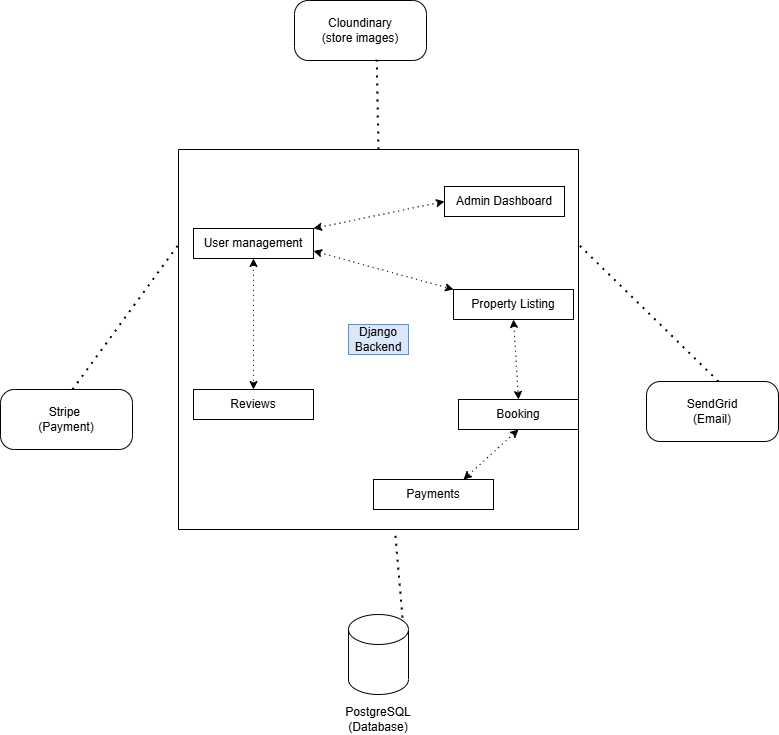

# Airbnb Clone Backend – Features and Functionalities

This document provides an extensive overview of the features and functionalities that the backend of the Airbnb Clone project must support. All descriptions and design decisions are based on the chosen technology stack:

- **Backend Framework:** Python (Django & Django REST Framework)
- **Database:** PostgreSQL
- **Email Service:** SendGrid
- **Cloud Storage:** Cloudinary
- **Payments:** Stripe

---

## Table of Contents

1. [Overview](#overview)
2. [Core Features](#core-features)
    - [1. User Management](#1-user-management)
    - [2. Property Listings Management](#2-property-listings-management)
    - [3. Search and Filtering](#3-search-and-filtering)
    - [4. Booking Management](#4-booking-management)
    - [5. Payment Integration](#5-payment-integration)
    - [6. Reviews and Ratings](#6-reviews-and-ratings)
    - [7. Notification System](#7-notification-system)
    - [8. Admin Dashboard](#8-admin-dashboard)
3. [Technical Integrations](#technical-integrations)
4. [Non-Functional Requirements](#non-functional-requirements)
5. [System Architecture Diagram](#system-architecture-diagram)
6. [Future Enhancements](#future-enhancements)
7. [References](#references)

---

## Overview

The Airbnb Clone backend is designed to power a property rental platform where users can list, discover, book, and review accommodations. The backend exposes RESTful APIs for all business logic, ensures data integrity and security, processes payments, and communicates with users through email notifications.

---

## Core Features

### 1. User Management

#### 1.1. Registration & Authentication
- Users can register as "Guests" or "Hosts."
- Email confirmation with activation link (via SendGrid).
- JWT-based authentication for secure, stateless user sessions.
- OAuth login support (Google, Facebook) for advanced implementations.

#### 1.2. Profile Management
- Users can update their profile information (name, bio, contact details).
- Profile picture uploads stored in Cloudinary.
- Password reset functionality through email.

#### 1.3. Role Management
- Differentiate permissions for Guests, Hosts, and Admins.
- Admins can deactivate or activate user accounts.

---

### 2. Property Listings Management

#### 2.1. Listing Creation & Management
- Hosts can create, edit, and delete property listings.
- Each listing includes:
  - Title & description
  - Location (address, city, country)
  - Price per night
  - Photo gallery (images uploaded to Cloudinary)
  - Amenities (Wi-Fi, kitchen, etc.)
  - Availability calendar

#### 2.2. Listing Visibility
- Listings can be made active/inactive by the host.
- Admins can verify or suspend listings.

#### 2.3. Listing Details Retrieval
- Anyone can view details of a public listing via API.

---

### 3. Search and Filtering

- Search properties by:
  - Location (city, country, address)
  - Price range
  - Number of guests
  - Property type (apartment, house, etc.)
  - Amenities (checkbox filters)
- Support for sorting (e.g., price, rating, newest)
- Pagination of search results for performance

---

### 4. Booking Management

#### 4.1. Booking Process
- Guests can request to book properties for specific dates.
- Real-time availability checking to avoid double bookings.

#### 4.2. Booking Status & Lifecycle
- Booking states: Pending, Confirmed, Cancelled, Completed.
- Hosts can accept or decline booking requests.
- Guests and hosts can cancel bookings under certain conditions (with possible penalties).

#### 4.3. Booking History
- Guests and hosts can view their booking histories.

---

### 5. Payment Integration

#### 5.1. Payment Processing
- Payments handled securely through Stripe.
- Guests pay at the time of booking; funds held in escrow.
- Stripe webhooks to update payment status in the backend.

#### 5.2. Host Payouts
- Hosts receive payouts after guest check-in (minus platform fees).
- Multiple currency support via Stripe.

#### 5.3. Invoices and Receipts
- Automatic generation and email delivery of invoices/receipts via SendGrid.

---

### 6. Reviews and Ratings

#### 6.1. Guest Reviews
- Guests can leave reviews and ratings for properties after checkout.
- Reviews are tied to completed bookings to prevent spam.

#### 6.2. Host Responses
- Hosts can reply to guest reviews.

#### 6.3. Review Moderation
- Admins can remove inappropriate reviews.

---

### 7. Notification System

- Email notifications (via SendGrid) for:
  - Booking confirmations/cancellations
  - Payment receipts
  - Upcoming check-in/check-out reminders
  - Password resets and account activity
- (Optional) In-app notification support for future phases.

---

### 8. Admin Dashboard

#### 8.1. User Management
- View, activate/deactivate, and manage users.
- View user activity and reports.

#### 8.2. Listing Oversight
- Moderate property listings (approve, suspend, or remove listings).

#### 8.3. Booking and Payment Monitoring
- View all bookings and payment statuses.
- Manually resolve disputes or issues.

#### 8.4. Review Moderation
- Remove or flag inappropriate reviews.

---

## Technical Integrations

- **Django REST Framework:** Main API interface.
- **PostgreSQL:** Primary relational database for all persistent data.
- **SendGrid:** SMTP/email API for all transactional emails and notifications.
- **Cloudinary:** Storage and management of all user and property images.
- **Stripe:** Payment processing, payout management, and webhook event handling.
- **Redis:** (Optional, for caching sessions, queries, etc.)

---

## Non-Functional Requirements

- **Security:** HTTPS, JWT authentication, input validation, password hashing.
- **Performance:** Database indexing, query optimization, caching frequent queries.
- **Scalability:** Modular Django apps, prepared for horizontal scaling and load balancing.
- **Reliability:** Automated API and unit tests, robust error handling and logging.
- **Documentation:** Auto-generated API docs (Swagger/OpenAPI), inline code comments, and this project documentation.

---

## System Architecture Diagram

The following diagram (`airbnb-backend-features.png`) visually represents the relationship between major backend modules and external integrations:

> 

**Legend:**
- **Blue boxes:** Core Django modules (Users, Listings, Bookings, Payments, Reviews, Admin)
- **Green boxes:** External services (PostgreSQL, SendGrid, Cloudinary, Stripe)
- **Arrows:** Data flow and integration points

---

## Future Enhancements

- **GraphQL API support** for advanced client queries.
- **In-app messaging** between guests and hosts.
- **Mobile push notifications**.
- **Advanced analytics dashboard** for hosts and admins.
- **Localization and language support** for internationalization.

---

## References

- [Django Documentation](https://docs.djangoproject.com/)
- [Django REST Framework](https://www.django-rest-framework.org/)
- [PostgreSQL Documentation](https://www.postgresql.org/docs/)
- [SendGrid for Django](https://docs.sendgrid.com/for-developers/sending-email/django)
- [Cloudinary Django Integration](https://cloudinary.com/documentation/django_integration)
- [Stripe Python API](https://stripe.com/docs/api/python)
- [ALX Project Guidelines](https://alx-intranet.hbtn.io)

---

**Prepared by:**  
Shadrack Kaku  
Date: 2025-07-04