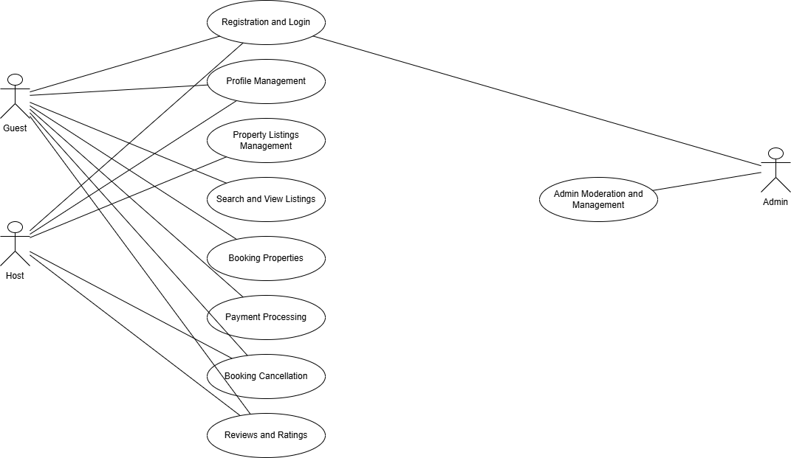

# Airbnb Clone Backend – Use Case Diagram

This directory contains the use case diagram for the Airbnb Clone backend project.

## Overview

The use case diagram visually represents the interactions between different users (actors) and the key features of the system. It highlights how Guests, Hosts, and Admins interact with functionalities such as registration, booking, payments, listings management, and reviews.

## Actors

- **Guest:** Can search for listings, book properties, make payments, leave reviews, and manage their profile.
- **Host:** Can manage property listings, respond to reviews, approve or decline bookings, and view dashboards.
- **Admin:** Can manage users, moderate listings and reviews, and access administrative dashboards.

## Main Use Cases

- Registration and Login
- Profile Management
- Property Listings Management
- Search and View Listings
- Booking Properties
- Payment Processing
- Booking Cancellation
- Reviews and Ratings
- Admin Moderation and Management

## Diagram

See the diagram file:  

---

**Prepared by:**  
Shadrack Kaku  
Date: 2025-07-05